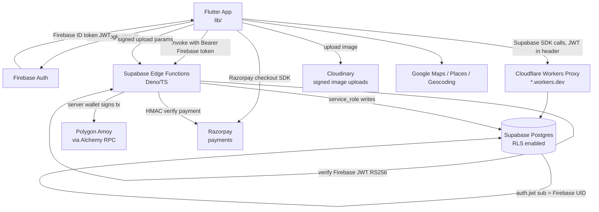

# PawGuard — Project Context

> Single-file orientation doc for any AI agent or new developer. Derived by reading the actual repo on branch `main` (2026-06-28). Where something is inferred rather than read directly from a file, it is marked **(inferred)**.

---

## Project Overview

**PawGuard** is a cross-platform **Flutter** application for animal rescue, pet adoption, lost-pet networking, animal-wellness crowdfunding, a pet-supplies marketplace, and veterinary medical records. Its differentiator is a **blockchain trust layer** (Polygon Amoy testnet) that immutably records pet ownership, crowdfunding donations/transparency, and medical-record integrity hashes. Users never touch a wallet — all on-chain writes are performed server-side by a backend wallet via **Supabase Edge Functions**. It is a **monorepo** with three deliverables: the Flutter app, the Solidity/Hardhat contracts, and a (still mostly unbuilt) public web verification portal. Audience: pet owners, adopters, rescuers/NGOs, donors, and (gated) veterinarians — primary target platform is **Android**.

---

## Architecture

Three independently-deployed subsystems exist in this repo: the **Flutter client**, the **Supabase backend** (Postgres + Deno Edge Functions), and the **Solidity contracts** (deployed to Polygon Amoy). A planned Next.js **website** is documented but not yet committed (`website/` holds only a TODO).



**Key flows / invariants:**
- **Auth bridge:** Firebase Auth is the identity provider. The Flutter client passes the Firebase **ID token** to Supabase via the `accessToken` callback in `Supabase.initialize` ([main.dart:32-38](pawguard-app/lib/main.dart#L32-L38)). Supabase RLS policies read `auth.jwt() ->> 'sub'` = Firebase UID. There is **no Supabase Auth user table** — identity is entirely Firebase.
- **Edge Functions verify JWTs themselves.** Most functions run with `verify_jwt = false` at the gateway, so each function that acts per-user calls `requireFirebaseUid()` ([_shared/auth.ts](pawguard-app/supabase/functions/_shared/auth.ts)), validating the token RS256 against Google's JWKS. Identity is taken **only** from the verified token, never the request body.
- **Blockchain writes are server-only.** Contracts are `Ownable`; only the backend "server wallet" (`SERVER_WALLET_PRIVATE_KEY`, held as a Supabase secret) can call `registerPet`, record donations, commit medical hashes. Client never signs anything on-chain.
- **Network egress is proxied.** `SUPABASE_URL` points at a **Cloudflare Workers** subdomain that proxies to the real Supabase project, to bypass ISP blocks (never the bare `*.supabase.co`).
- **Data-then-chain pattern:** rows are written to Postgres first; on-chain registration is a follow-up action that backfills `tx_hash` / `data_hash` / `on_chain_status` columns. Hashes are computed **server-side from the authoritative DB row**, not from client input.

---

## Tech Stack

### `pawguard-app/` — Flutter client
| Layer | Tech / Package | Version | Notes |
|---|---|---|---|
| Runtime | Flutter / Dart SDK | `^3.7.0` | Android primary; iOS/web/macOS/linux/windows scaffolding present |
| State mgmt + DI | `flutter_riverpod` | `^3.2.1` | Providers everywhere; `UncontrolledProviderScope` at root |
| Backend client | `supabase_flutter` / `supabase` | `^2.8.0` / `^2.10.2` | Postgres, RPC, Realtime, edge invoke |
| Auth | `firebase_auth` / `firebase_core` | `^5.4.2` / `^3.11.0` | + `google_sign_in: 6.2.1` |
| Payments | `razorpay_flutter` | `^1.3.7` | INR; secret stays server-side |
| Maps/Location | `google_maps_flutter` `^2.12.2`, `geolocator` `^14.0.0`, `geocoding` `^3.0.0` | | for rescue reports |
| Media | `cached_network_image` `^3.4.1`, `image_picker` `^1.1.2`, `flutter_svg`, `lottie` `^3.3.2`, `carousel_slider` `^5.0.0`, `video_player`/`chewie`/`cached_video_player_plus` | | rescue videos, animations |
| Misc | `crypto` `^3.0.6`, `uuid` `^4.5.1`, `qr_flutter` `^4.1.0`, `connectivity_plus` `^6.1.4`, `shared_preferences` `^2.3.2`, `url_launcher`, `intl`, `glassmorphism_ui`, `responsive_framework`, `google_fonts` | | |
| Dev | `flutter_lints` `^5.0.0`, `flutter_test`, `flutter_launcher_icons`, `flutter_native_splash` | | |
| pubspec `name` | `adoption_ui_app` | | legacy project name; Android package `com.example.adoption_app_2` |

### `pawguard-app/supabase/functions/` — Edge Functions (Deno + TypeScript)
- Runtime: **Deno** (`Deno.serve`), TypeScript, imports via `npm:` specifiers.
- Key deps: `ethers@^6` (Polygon), `jose@^5` (Firebase JWT verify), `@supabase/supabase-js` (service-role client).
- 17 functions + a `_shared/` library of 9 modules. Config in `supabase/config.toml` (per-function `verify_jwt` flags).

### `pawguard-contracts/` — Solidity smart contracts
| Tech | Version |
|---|---|
| Solidity | `0.8.28` (optimizer on, runs 200) |
| Tooling | **Hardhat 3** (`^3.1.10`) + `hardhat-toolbox-mocha-ethers`, `ethers@^6`, `mocha`/`chai`, Foundry `forge-std` for Solidity tests |
| Libraries | `@openzeppelin/contracts` `^5.6.1` (`Ownable`) |
| Network | Polygon **Amoy** testnet, chainId `80002`, RPC from `POLYGON_RPC_URL` (Alchemy) with public fallback |
| Module system | ESM (`"type": "module"`) |

### `website/` — public verification portal
- **Planned Next.js** app on Vercel (`WEBSITE_TODO.md`). **Not yet implemented** — only the TODO is committed. A live redirect at `https://pawguard-web-ten.vercel.app/pet/{id}` is referenced but its source is not in the repo.

---

## Directory Structure

```
Pawguard/                          # monorepo root
├── README.md                      # quick-start for all three projects
├── REMAINING_WORK.md              # ⭐ authoritative TODO (2026-06-28), supersedes DOCS/TODO/
├── PROMPTS.md                     # (untracked)
├── DOCS/                          # product + reference docs
│   ├── SPECS/PawGuard_PRD_v2.md   # product requirements (referenced as PRD §x.x in code)
│   ├── RULES/rules.md             # ⭐ binding AI/dev ruleset (see Conventions)
│   ├── AUDIT/                      # security + audit reports
│   ├── REFERENCE/                 # blockchain context, supabase_info.md
│   └── TODO/                      # STALE (March 2026) — superseded by /REMAINING_WORK.md
│
├── pawguard-app/                  # ── FLUTTER APP ──
│   ├── ARCHITECTURE.md, STACK.md  # /map-generated docs (note: say "mainnet"; actually Amoy)
│   ├── pubspec.yaml               # name: adoption_ui_app
│   ├── .env.example / .env.client.example  # client vs full key inventory
│   ├── analysis_options.yaml
│   ├── lib/
│   │   ├── main.dart              # entry point ONLY — Firebase+Supabase init, auth-gated home
│   │   ├── config/               # api_keys.dart, app_config.dart, routes.dart
│   │   ├── core/                 # app_logger, app_exception, campaign_ownership,
│   │   │   ├── services/         #   blockchain_result, edge_function_invoker,
│   │   │   │                     #   realtime_stream_builder, blockchain_error_mapper
│   │   │   └── utils/relative_time.dart
│   │   ├── theme/color.dart
│   │   ├── services/             # cross-cutting services + Riverpod providers:
│   │   │                         #   supabase_service, firebase_auth_service, session_service,
│   │   │                         #   connectivity_service, cloudinary_service, qr_service,
│   │   │                         #   auth_rate_limiter, providers/service_providers.dart
│   │   ├── shared/models/        # blockchain_result.dart (shared)
│   │   ├── widgets/              # app-wide reusable widgets (app_dialog, custom_toast,
│   │   │                         #   no_internet_banner, scroll_to_top_button)
│   │   ├── models/              # pet_with_chain_status.dart
│   │   ├── main/                # app shell: dashboard, login, profile, nav, app bars,
│   │   │                        #   home/rescue widgets, settings, routing transitions
│   │   └── modules/            # ⭐ feature modules (domain-driven), each:
│   │       │                   #   screens/ widgets/ services/ models/ providers/ utils/ README.md
│   │       ├── adoption/        # pet feed, upload wizard, pet details, favorites, on-chain register
│   │       ├── crowdfunding/    # campaigns, donations, donors, success stories, create wizard
│   │       ├── marketplace/     # products, cart, checkout, orders, reviews, Razorpay
│   │       ├── medical/         # vet records + on-chain hash commit/verify (BUILT, NOT WIRED)
│   │       ├── my_pets/         # ownership cards, transfer (codes/QR), audit trail
│   │       └── rescue/          # report animal, NGO directory, location picker
│   ├── migrations/             # 13 raw SQL migrations (schema + RLS + RPCs), run in order
│   ├── supabase/
│   │   ├── config.toml         # per-function verify_jwt config
│   │   └── functions/
│   │       ├── _shared/        # auth, ethereum, audit, blockchain-init/-tx-lifecycle,
│   │       │                   #   constants, razorpay, response, supabase-client
│   │       └── <17 functions>/ # register-pet, transfer-pet, accept/cancel/decline-transfer,
│   │                           #   create-campaign, record-donation, add-testimonial,
│   │                           #   commit-medical-hash, verify-hash, verify-pet,
│   │                           #   update-pet-status, get-pet-audit-trail, lookup-user,
│   │                           #   sign-cloudinary-upload, verify-razorpay-payment, ...
│   ├── android/ ios/ web/ macos/ linux/ windows/   # platform runners
│   ├── assets/                 # icons (svg), images, lottie animations, logo
│   └── test/                   # ⚠️ only example_test.dart (near-zero coverage)
│
├── pawguard-contracts/         # ── SOLIDITY CONTRACTS ──
│   ├── contracts/             # PetRegistry, CrowdfundLedger, MedicalHashRegistry,
│   │                          #   Counter.sol/.t.sol (Hardhat template leftover — delete)
│   ├── deployed-addresses.json # 3 deployed Amoy addresses
│   ├── hardhat.config.ts      # amoy network, chainId 80002, optimizer
│   ├── scripts/               # deploy*, redeploy-all, sync-pending-transactions, fix-nonce...
│   ├── test/                  # PetRegistry.ts, Counter.ts only
│   └── RULES/rules.md
│
├── supabase/                   # root-level supabase (separate project ref) +
│   └── functions/create-razorpay-order/   # Razorpay order-creation function
└── website/WEBSITE_TODO.md     # planned Next.js portal (not built)
```

> Note: there are **two** `supabase/functions` trees — the main one under `pawguard-app/supabase/functions/` and a root `supabase/functions/create-razorpay-order/`. The root `supabase/.temp/` holds the linked project ref/versions. **(inferred:** the app links to the Supabase project at the root level; most functions live under `pawguard-app`.)

---

## Core Domain Models

Models live per-module under `lib/modules/<feature>/models/`. Postgres tables are defined across `pawguard-app/migrations/*.sql`. Each on-chain entity has a paired contract.

### Pets (adoption + ownership)
- **Dart:** `Pet` ([adoption/models/pet.dart](pawguard-app/lib/modules/adoption/models/pet.dart)) — has `fromSupabase`/`toSupabase` (+ legacy `fromFirestore`/`toMap`). Blockchain fields: `txHash`, `onChainStatus`, `dataHash`. `PetWithChainStatus` ([lib/models/pet_with_chain_status.dart](pawguard-app/lib/models/pet_with_chain_status.dart)) wraps chain state.
- **DB:** `pets` table — adds `tx_hash`, `on_chain_status` (CHECK: `OWNED|FOR_ADOPTION|LOST|DECEASED`), `data_hash`, `registered_at_block`. Owner = `owner_uid` (Firebase UID).
- **Chain:** `PetRegistry.sol` — `Pet{ownerAddress, dataHash, registeredAt, transferCount, status}`; `petId = keccak256(UUID)`; transfer is 2-step (`initTransfer` → `confirmTransfer`); vets approved via `approvedVets` mapping.
- Related: `adoption_listings`, `lost_pets`, `transfer_codes`, `PendingTransfer`, `UserSearchResult` (my_pets module).

### Campaigns / Crowdfunding
- **Dart:** `Campaign`, `Donation`, `Donor`, `CampaignProgressUpdate`, `CampaignTestimonial`, `CampaignReviewData`, `SuccessStory` (`crowdfunding/models/`).
- **DB:** `campaigns` (`campaign_id_hash`, `raised_amount_on_chain` in paise, `on_chain_status` CHECK `OPEN|FROZEN|DISPUTED|RESOLVED|CLOSED|EXPIRED`), `donations`, `success_stories`.
- **Chain:** `CrowdfundLedger.sol` — data-only ledger (holds no funds), amounts in **INR paise**, statuses, expenditure hashes, dispute stakes.

### Medical Records
- **Dart:** `MedicalRecord`, `VerificationResult` (`medical/models/`).
- **DB:** `medical_records` (`pet_id` FK, `vet_uid`, `record_type`, `record_hash` SHA-256, `record_version`, `previous_hash` amendment chain, `committed_at`).
- **Chain:** `MedicalHashRegistry.sol` — stores only SHA-256 hashes (DPDP Act 2023: full records never on-chain), versioned `records[recordId][version]`, `RecordType{PRESCRIPTION,DIAGNOSIS,VACCINATION}`.

### Marketplace
- **Dart:** `Product`, `CartItem`, `Order`, `Review` (`marketplace/models/`).
- **DB:** `products`, `cart_items`; order placement via RPCs `place_order` / `place_paid_order`; stock via `decrement_stock`/`increment_stock`.

### Rescue
- **Dart:** `NgoModel` (`rescue/models/`). **DB:** `rescue_reports`.

### Cross-cutting / infra tables
- `blockchain_transactions` — append-only audit log of every on-chain tx (immutability enforced by trigger `guard_blockchain_tx_immutability`).
- `user_roles` — role gating (e.g. vet role; see migration 012).
- `BlockchainResult` (`shared/models/` + `core/services/blockchain_result.dart`) — typed result union (`BlockchainSuccess` / `BlockchainMocked` / error) used to surface on-chain outcomes to UI.

---

## Data Flow

### Example: registering a pet on-chain (`upload → register-pet`)
1. User completes the upload wizard (`adoption/screens/upload/`). The pet row is inserted into Postgres `pets` (via `PetService` → `supabase_service`), `owner_uid = Firebase UID`.
2. App invokes the `register-pet` Edge Function through `EdgeFunctionInvoker` ([core/services/edge_function_invoker.dart](pawguard-app/lib/core/services/edge_function_invoker.dart)), passing the **Firebase ID token** as `Authorization: Bearer`.
3. `register-pet` ([index.ts](pawguard-app/supabase/functions/register-pet/index.ts)): `requireFirebaseUid` → fetch the pet row (service-role client) → assert `pet.owner_uid === callerUid` → `computePetDataHash()` over a **fixed field list** from the DB row (not client input) → `petIdToBytes32`.
4. Connects server wallet (`initWallet`), pre-flight balance check, `contract.registerPet(petId, dataHash)` via `sendWithRetry` (exponential backoff on RPC 429).
5. Inserts **one** audit row in `blockchain_transactions` (status `pending`), writes `tx_hash`+`data_hash` to `pets` immediately (in-flight).
6. `waitForConfirmation` (~5–15s) → on confirm: `markAuditConfirmed` + update `pets.on_chain_status='OWNED'`; on timeout: leave `PENDING`; on revert: `markAuditReverted` + clear `tx_hash`/`data_hash` so user can retry.
7. Returns structured `successResponse`/`errorResponse`; UI maps it through `BlockchainErrorMapper` → `BlockchainResult` → badge/toast.

### Example: reading the adoption feed (realtime)
1. UI `ConsumerWidget` watches `feedPetsProvider` (a `StreamProvider.autoDispose`) in [adoption/providers/pet_providers.dart](pawguard-app/lib/modules/adoption/providers/pet_providers.dart).
2. The provider reads `petServiceProvider` → `PetService.getFeedPets()`, built on `RealtimeStreamBuilder` (subscribes to a Supabase channel + re-fetches on change).
3. Postgres RLS (Firebase UID via JWT) scopes rows; results map through `Pet.fromSupabase`.
4. Mutations (`ref.read(petServiceProvider).…`) call service methods that wrap Supabase calls in try/catch and throw `AppException`.

### Auth/session lifecycle
- `main()` → `Firebase.initializeApp()` → `Supabase.initialize(accessToken: firebase idToken)` → `ConnectivityService.initialize()` → `sessionServiceProvider.start()` (idToken listener + inactivity tracking). `MyApp` watches `authStateProvider`; `data → MainDashboard | LoginPage`. App-resume touches last-active (§9.4 inactivity timeout).

---

## Conventions & Patterns

> The binding ruleset is **[DOCS/RULES/rules.md](DOCS/RULES/rules.md)** — read it before contributing. Highlights actually observed in code:

- **Layered module layout:** `lib/modules/<feature>/{screens,widgets,services,models,providers,utils}` + a `README.md` per module. Cross-cutting infra in `lib/core/`, `lib/services/`, `lib/shared/`, `lib/widgets/`.
- **300-line file cap:** files are aggressively decomposed. Large services use Dart **`part`/`part of`** to split one class across files (e.g. `PetService` composes mixins `_PetServiceBlockchainCore`, `_PetServiceTransfer`, `_PetDiscoveryService`, `_PetFavoritesService`, `_PetLifecycleService` via `part` — see [pet_service.dart](pawguard-app/lib/modules/adoption/services/pet_service.dart)). Widgets/logic split into `_logic.dart` / `_widgets.dart` / `_components.dart` files. Recent commits ("Phase 1/2 refactor") split 9 large files.
- **State management = Riverpod, no inline instantiation:** services are exposed as `Provider`s (e.g. `petServiceProvider`, `firebaseAuthProvider`). Data via `StreamProvider.autoDispose` / `FutureProvider.autoDispose`; use `ref.watch` in `build`, `ref.read` for actions. No raw singletons (migration "in progress" per rules, but largely done).
- **Service rules:** one service per table/external API; no `BuildContext`, navigation, or UI in services; **never bare `.select()`** — always list columns; wrap Supabase calls in try/catch and throw typed `AppException` (never leak `PostgrestException` to UI). See [core/app_exception.dart](pawguard-app/lib/core/app_exception.dart).
- **Models:** `fromSupabase(Map)` / `toSupabase()` pair; snake_case DB columns ↔ camelCase Dart; immutable `final` fields. (Legacy `fromFirestore`/`toMap` still present on `Pet` from a prior Firestore era — **(inferred)** dead/transitional.)
- **Logging:** structured `AppLogger` ([core/app_logger.dart](pawguard-app/lib/core/app_logger.dart)) guarded by `kDebugMode`; no raw `print()`/`debugPrint()` in production paths.
- **Routing:** named-route constants in [config/routes.dart](pawguard-app/lib/config/routes.dart); all redirects/deep-links validated against an allowlist (`sanitiseRedirect`, `isAllowedDeepLinkPath`). Pass IDs not model objects.
- **Secrets:** only via `String.fromEnvironment` in [config/api_keys.dart](pawguard-app/lib/config/api_keys.dart), injected at build with `--dart-define-from-file=.env.client`. Client gets **only** public keys (Supabase anon, Google, Cloudinary cloud_name+api_key, Razorpay key_id). Server secrets (wallet key, service role, Razorpay secret, contract addresses, RPC URL) live as **Supabase Edge secrets**, never in the binary.
- **Edge Function conventions:** `Deno.serve`; CORS preflight via `corsPreflightResponse()`; uniform `successResponse`/`errorResponse(msg, CODE, status)`; identity via `requireFirebaseUid`; service-role client via `getServiceClient()`; on-chain via `_shared/ethereum.ts` + `_shared/blockchain-tx-lifecycle.ts`; every tx logged to `blockchain_transactions` (create pending row → mark confirmed/reverted).
- **Blockchain hashing is canonical & server-side:** `computePetDataHash` uses a **fixed, ordered field list** (`PET_HASH_FIELDS`) and trims strings so transfers/UI changes don't invalidate the hash. Changing the list/order is a breaking change.
- **DB security:** RLS on every table; per-user policies keyed on `auth.jwt() ->> 'sub'`; sensitive writes go through `SECURITY DEFINER` RPCs (e.g. `place_paid_order`, `claim_transfer_code`, `increment_campaign_counters`); blockchain columns protected by triggers (`protect_blockchain_columns_*`). Migrations are incremental and hardening-focused (002–013 progressively tighten RLS, grants, atomic counters, vet role gate).
- **Contracts:** NatSpec on every function; `Ownable` admin gate; PRD section references in comments (`PRD §8.2`). INR amounts in **paise**.
- **Commits:** Conventional Commits (`feat:`, `refactor:`, `docs:`…), one concern each; always commit `pubspec.lock`, migrations, `.env.example`.

---

## Known Gaps / TODOs

> Source of truth: **[REMAINING_WORK.md](REMAINING_WORK.md)** (verified vs live code 2026-06-28). `DOCS/TODO/` is **stale** (March 2026) and superseded.

- **Untested refactor:** latest commit `c7de013 refactor (not tested yet)` — the Phase 1/2 file splits have not been verified. Run `flutter analyze` / build before trusting.
- **P1 — Two contracts deployed but still mocked:** `CrowdfundLedger` + `MedicalHashRegistry` are deployed (`deployed-addresses.json`) but `record-donation` / `commit-medical-hash` return `BlockchainMocked` because their address env vars aren't set as Supabase secrets. **Also a real mismatch:** `.env` example/secret points `PET_REGISTRY_ADDRESS=0x870e6c…` but `deployed-addresses.json` says `0xe2753f…` — must be reconciled. Config-only fix.
- **P2a — Medical module is fully built but unreachable:** no route/nav entry to `AddMedicalRecordScreen`; any logged-in user is silently stored as `vetUid`. Needs a real **vet role system** (migration 012 started `user_roles` / vet gate) + server enforcement + UI wiring on `MyPetDetailScreen`.
- **P2b — In-app chat is dead code:** `chat_item.dart` / `contact_owner_sheet.dart` exist but contact is external-only (email/phone via `url_launcher`). No `conversations`/`messages` tables. Greenfield.
- **P3 — QR round-trip incomplete:** QR **generation** works (`qr_service.dart` → `AppConfig.qrPetDeepLinkBase`), but there is **no in-app scanner**, **no inbound deep-link handling** (`app_links`/`uni_links` absent), **no `/pet/<id>` target screen**, and AndroidManifest has no VIEW/BROWSABLE intent-filter. The **website portal is not built** (`website/` = TODO only); `AppConfig.qrPetDeepLinkBase` still points at a staging Vercel URL (`app_config.dart:17` TODO).
- **P4 — Missing owner actions (UI-only):** Mark **For Adoption** and Mark **Deceased** have no buttons though the full stack (`PetRegistry` enum, `update-pet-status` edge fn, `pet_service.updatePetStatus`) supports them. No edit-pet-profile form.
- **P5 — Near-zero tests:** `pawguard-app/test/` has only `example_test.dart`; contract tests cover only `Counter` + `PetRegistry`. `Counter.sol`/`Counter.t.sol`/`ignition/modules/Counter.ts` are Hardhat template leftovers to delete.
- **Tech debt (from ARCHITECTURE.md):** `supabase_service.dart` slated for removal once all direct usages move to the Riverpod provider; crowdfunding `typography.dart` is a FIXME duplicate of theme typography; `AppLogger` has a `TODO(crashlytics)` — Crashlytics not yet integrated.
- **Legacy naming:** Flutter project is `adoption_ui_app` / package `com.example.adoption_app_2`; `Pet` model retains unused `fromFirestore`/`toMap` from a prior Firestore design **(inferred)**.
- **Docs drift:** `pawguard-app/ARCHITECTURE.md` & `STACK.md` say "Polygon mainnet" but the code targets **Polygon Amoy testnet** (chainId 80002). Trust the code.

---

## Setup & Run

### Prerequisites
Flutter `^3.7.0` SDK, Node.js + npm, (optional) Supabase CLI + Deno for edge functions, a funded Polygon Amoy server wallet for live on-chain features.

### Flutter app
```powershell
cd pawguard-app
flutter pub get
# Copy the CLIENT env template and fill in PUBLIC keys only:
copy .env.client.example .env.client   # Supabase(proxy) URL+anon, Google, Cloudinary, Razorpay key_id
flutter run --dart-define-from-file=.env.client
```
- **Never** pass `.env` (full inventory incl. server secrets) to `--dart-define-from-file` — use `.env.client`.
- `SUPABASE_URL` should be the **Cloudflare Workers proxy** URL, not the bare `*.supabase.co`.
- Missing Supabase config throws at startup (`main.dart` guards `supabaseUrl`/`supabaseAnonKey`).
- Firebase needs `google-services.json` (Android) — git-ignored, supply locally. Firebase project id default in code: `os-project-73b5c`.

### Smart contracts
```powershell
cd pawguard-contracts
npm install
npx hardhat test                 # local Solidity + mocha tests
# Deploy to Amoy (needs POLYGON_WALLET_PRIVATE_KEY + POLYGON_RPC_URL in .env):
npm run deploy:amoy              # hardhat run scripts/deploy.ts --network amoy
npm run sync:pending             # reconcile stuck/pending txs
```

### Supabase Edge Functions
```powershell
# Set server secrets (never in client builds):
supabase secrets set SERVER_WALLET_PRIVATE_KEY=0x... POLYGON_RPC_URL=https://polygon-amoy.g.alchemy.com/v2/<key>
supabase secrets set PET_REGISTRY_ADDRESS=0x... CROWDFUND_LEDGER_ADDRESS=0x... MEDICAL_HASH_REGISTRY_ADDRESS=0x...
supabase secrets set FIREBASE_PROJECT_ID=os-project-73b5c
# Apply schema (migrations/*.sql in numeric order), then deploy functions:
supabase functions deploy register-pet   # repeat per function, or deploy all
```
- DB schema is the 13 `pawguard-app/migrations/migration_0XX_*.sql` files, applied in order (001 = blockchain columns + medical_records table; later ones add RLS, RPCs, atomic counters, vet gate).
- Edge function JWT gateway behavior is per-function in `supabase/config.toml`; user-specific functions verify the Firebase token in-code regardless.

### Website
Not yet implemented — see `website/WEBSITE_TODO.md` (planned Next.js on Vercel).
